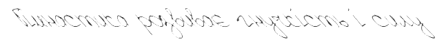
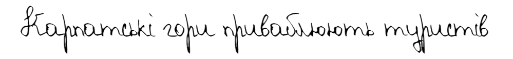
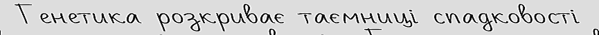
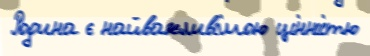
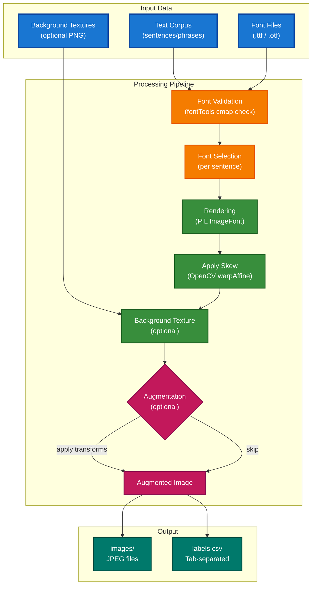

# Synthetic Handwriting Dataset Generator

<div align="center">

[](https://github.com/ValeriiSielikhov/ukrainian-handwriting-synth/actions)
[](https://www.python.org/)
[](LICENSE)
[](https://docs.astral.sh/uv/)
[](https://docs.astral.sh/ruff/)
[](https://github.com/ValeriiSielikhov/ukrainian-handwriting-synth/blob/main/CONTRIBUTING.md)

</div>

A tool for generating synthetic handwritten text images from digital fonts — designed for training OCR and HTR models.


<table style="width: 100%;">
<tr>
<td style="width: 50%;"></td>
<td style="width: 50%;"></td>
</tr>
<tr>
<td></td>
<td></td>
</tr>
<tr>
<td></td>
<td></td>
</tr>
<tr>
<td></td>
<td></td>
</tr>
</table>

## Overview

This project renders text strings using handwriting-style fonts and produces labeled image datasets. Each image is a single line of text with randomized font size, skew, and optional augmentations applied. The output is ready for use as training data for optical character recognition (OCR) or handwritten text recognition (HTR) pipelines.

The generator is built with Ukrainian in mind but can be adapted to any language by providing the appropriate text corpus and fonts.

## Features

- **Font validation** — automatically discovers and validates fonts against required character sets using `fontTools` cmap tables (no fallback glyphs)
- **Randomized rendering** — each sample varies font, size, skew, page color (white, cream, off-white), and ink color (black, dark blue, navy, violet) with per-channel jitter for realistic diversity
- **Background textures** — optional PNG textures (lined, grid, kraft) from a directory; applied with configurable probability to simulate paper surfaces
- **Augmentation pipeline** — morphological transforms, noise, geometric distortions (rotate, perspective, width change), background artifacts (stains, shadows), color shifts, **InkColorShift** (blue/violet ink variation), **PaperAgeing** (sepia-like yellowing); optimized for throughput (lightweight transforms, per-worker pipeline caching, auto-reduced workers when augmentation is enabled)
- **Parallel generation** — multiprocess workers for fast dataset creation; worker count is automatically reduced when augmentation is active to prevent system overload
- **Structured output** — images saved as JPEGs with a tab-separated labels file mapping each image to its source text

## Project Structure

```mermaid
---
config:
  layout: dagre
---
flowchart TD
    classDef root fill:#1976d2,stroke:#0d47a1,stroke-width:3px,color:#fff
    classDef entry fill:#388e3c,stroke:#1b5e20,stroke-width:2px,color:#fff
    classDef config fill:#f57c00,stroke:#e65100,stroke-width:2px,color:#fff
    classDef module fill:#7b1fa2,stroke:#4a148c,stroke-width:2px,color:#fff
    classDef data fill:#c2185b,stroke:#880e4f,stroke-width:2px,color:#fff

    Root["."]:::root

    Root --> EntryGroup["Entry Points"]
    Root --> ConfigGroup["Configuration"]
    Root --> SourceGroup["Source Code"]
    Root --> DataGroup["Data"]

    subgraph EntryGroup[" "]
        direction TB
        Generate["generate.py<br/>CLI entry point"]:::entry
        Run["run.sh<br/>Quick-run helper"]:::entry
    end

    subgraph ConfigGroup[" "]
        direction TB
        PyProject["pyproject.toml<br/>Project metadata"]:::config
    end

    subgraph SourceGroup[" "]
        direction TB
        Src["src/"]
        UkrSynth["ukr_synth/"]:::module
        Src --> UkrSynth
        UkrSynth --> Init["__init__.py"]:::module
        UkrSynth --> ConfigPy["config.py"]:::module
        UkrSynth --> CorpusPy["corpus.py"]:::module
        UkrSynth --> CorpusReaderPy["corpus_reader.py"]:::module
        UkrSynth --> FontsPy["fonts.py"]:::module
        UkrSynth --> RendererPy["renderer.py"]:::module
        UkrSynth --> AugPy["augmentations.py"]:::module
        UkrSynth --> GeneratorPy["generator.py"]:::module
        UkrSynth --> LoggerPy["logger.py"]:::module
    end

    subgraph DataGroup[" "]
        direction TB
        Fonts["fonts/<br/>Font files"]:::data
        Images["images/<br/>Examples"]:::data
        DataDir["src/data/<br/>background textures"]:::data
    end
```



## Architecture



## Requirements

- Python >= 3.14
- Dependencies (installed automatically):
  - `pillow` — text rendering
  - `opencv-python` — image transforms, skew
  - `numpy` — array operations
  - `albumentations` — augmentation pipeline
  - `fonttools` — font glyph validation
  - `pandas` — labels file writing
  - `tqdm` — progress bars

## Installation

Using [uv](https://docs.astral.sh/uv/):

```bash
uv sync
```

Or with pip:

```bash
pip install -e .
```

## Usage

Run generation via CLI:

```bash
python generate.py \
    --output-dir output \
    --fonts-dir fonts \
    --num-per-sentence 1 \
    --augment-prob 0.5 \
    --backgrounds-dir src/data/background \
    --background-texture-prob 0.3 \
    --seed 42 \
    --workers 4
```

| Flag | Description | Default |
|---|---|---|
| `--output-dir`, `-o` | Root directory for images and labels | `output` |
| `--fonts-dir`, `-f` | Directory containing `.ttf` / `.otf` font files | `fonts` |
| `--num-per-sentence`, `-n` | Number of image variants per sentence | `1` |
| `--augment-prob`, `-a` | Probability of each augmentation stage (0 to disable) | `0.5` |
| `--backgrounds-dir`, `-b` | Directory with PNG texture backgrounds (lined, grid, kraft) | config default: `src/data/background` |
| `--background-texture-prob` | Probability of applying a texture background per image | `0.3` |
| `--seed`, `-s` | Random seed for reproducibility | `None` |
| `--workers`, `-w` | Number of parallel worker processes | CPU count - 2 (auto-reduced when augmentation is enabled) |

Or use the helper script:

```bash
bash run.sh
```

**Performance tip:** Use `--augment-prob 0` for maximum speed when augmentation is not needed. With augmentation enabled, worker count is automatically reduced to prevent system overload.

## Input Data

- **Text** — supplied by `corpus_reader()`, which reads JSONL files from `src/data/ukr_text_corpuses` (each line: `{"text_plain": "..."}`). Lines are split by newlines; subfolders are named after the source filename. If no JSONL files are found, it falls back to `SENTENCES` from `corpus.py`. You can also pass a list of strings or a dict mapping filename to list of sentences directly to `generate_dataset()`.
- **Fonts** — `.ttf` or `.otf` files placed in the fonts directory. Each font is automatically validated to ensure it contains proper glyphs for the target language characters — fonts with missing glyphs are excluded.
- **Background textures** — optional PNG images in `src/data/background` (default) or custom path via `--backgrounds-dir`. Textures (kraft.png, white_grid.png, white_lines.png) are applied with `--background-texture-prob` (default 0.3).

## Output

```
output/
├── images/
│   └── {subfolder}/
│       ├── FontName_000000.jpg
│       ├── FontName_000001.jpg
│       └── ...
└── labels.csv
```

- **images/** — rendered JPEG images, named `{FontName}_{index}.jpg`, organized in subfolders by corpus file and date
- **labels.csv** — tab-separated file with columns: image path, source text (no header)

## License

MIT
