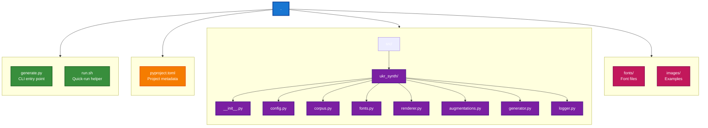
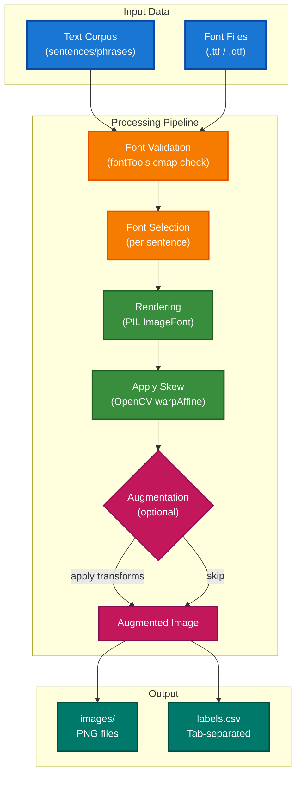

# Synthetic Handwriting Dataset Generator

A tool for generating synthetic handwritten text images from digital fonts — designed for training OCR and HTR models.


<table style="width: 100%;">
<tr>
<td style="width: 50%;"></td>
<td style="width: 50%;"></td>
</tr>
<tr>
<td></td>
<td></td>
</tr>
<tr>
<td></td>
<td></td>
</tr>
<tr>
<td></td>
<td></td>
</tr>
</table>

## Overview

This project renders text strings using handwriting-style fonts and produces labeled image datasets. Each image is a single line of text with randomized font size, skew, and optional augmentations applied. The output is ready for use as training data for optical character recognition (OCR) or handwritten text recognition (HTR) pipelines.

The generator is built with Ukrainian in mind but can be adapted to any language by providing the appropriate text corpus and fonts.

## Features

- **Font validation** — automatically discovers and validates fonts against required character sets using `fontTools` cmap tables (no fallback glyphs)
- **Randomized rendering** — each sample varies font, size, and horizontal skew for realistic diversity
- **Augmentation pipeline** — morphological transforms, noise, geometric distortions, background artifacts, shadows, and color shifts via `albumentations` and custom transforms
- **Parallel generation** — multiprocess workers for fast dataset creation
- **Structured output** — images saved as PNGs with a tab-separated labels file mapping each image to its source text

## Project Structure



## Architecture



## Requirements

- Python >= 3.14
- Dependencies (installed automatically):
  - `pillow` — text rendering
  - `opencv-python` — image transforms, skew
  - `numpy` — array operations
  - `albumentations` — augmentation pipeline
  - `fonttools` — font glyph validation
  - `pandas` — labels file writing
  - `tqdm` — progress bars

## Installation

Using [uv](https://docs.astral.sh/uv/):

```bash
uv sync
```

Or with pip:

```bash
pip install -e .
```

## Usage

Run generation via CLI:

```bash
python generate.py \
    --output-dir output \
    --fonts-dir fonts \
    --num-per-sentence 10 \
    --augment-prob 0.5 \
    --seed 42 \
    --workers 4
```

| Flag | Description | Default |
|---|---|---|
| `--output-dir`, `-o` | Root directory for images and labels | `output` |
| `--fonts-dir`, `-f` | Directory containing `.ttf` / `.otf` font files | `fonts` |
| `--num-per-sentence`, `-n` | Number of image variants per sentence | `10` |
| `--augment-prob`, `-a` | Probability of each augmentation stage (0 to disable) | `0.5` |
| `--seed`, `-s` | Random seed for reproducibility | `None` |
| `--workers`, `-w` | Number of parallel worker processes | CPU count |

Or use the helper script:

```bash
bash run.sh
```

## Input Data

- **Text** — a list of sentences or phrases to render. Provided as a Python list in the corpus module or any iterable of strings.
- **Fonts** — `.ttf` or `.otf` files placed in the fonts directory. Each font is automatically validated to ensure it contains proper glyphs for the target language characters — fonts with missing glyphs are excluded.

## Output

```
output/
├── images/
│   ├── FontName_000000.png
│   ├── FontName_000001.png
│   └── ...
└── labels.csv
```

- **images/** — rendered PNG images, named `{FontName}_{index}.png`
- **labels.csv** — tab-separated file with columns: image path, source text (no header)

## License

MIT
